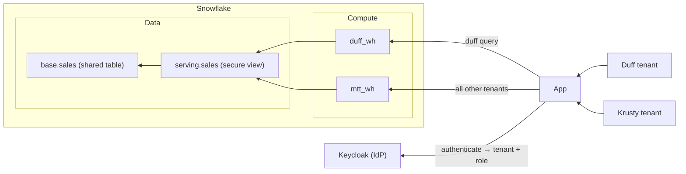

# Variation: Noisy Neighbor

## Situation

In the basic MTT architecture, all tenants share all data and compute resources.
If a particular tenant has a greater volume of queries or higher rates of
concurrency than their neighbors (the other tenants), this can cause queueing
and performance issues for everyone. This is the noisy neighbor problem.

With Snowflake, we can simply provision a dedicated warehouse for the noisy
tenant and route their queries through that compute instead of the shared
`mtt_wh`.



In the example above, Duff is allocated its own warehouse, yet the same database
is still used by all tenants, including Duff. However, Duff's usage won't affect
the other tenants as they have their own dedicated compute (which they can be
charged for at a premium by the provider).

## How to achieve this

### 1. Provision a dedicated warehouse

Add a variation migration, `data/migrations/006_noisy_neighbor.sql`, mirroring
how `002_objects.sql` creates `mtt_wh`:

```sql
USE ROLE ACCOUNTADMIN;

-- Dedicated compute for the noisy tenant (Duff).
CREATE WAREHOUSE IF NOT EXISTS duff_wh
  WAREHOUSE_SIZE = 'XSMALL' AUTO_SUSPEND = 60 AUTO_RESUME = TRUE INITIALLY_SUSPENDED = TRUE;
GRANT USAGE ON WAREHOUSE duff_wh TO ROLE mtt_admin;
```

### 2. Grant usage to the tenant's role and service principal

Warehouse `USAGE` is granted to roles, not users. Grant it to Duff's two roles;
the `tenant_duff_svc` service principal inherits access through them. Append to
the same migration:

```sql
-- Duff's roles get usage on the dedicated warehouse; krusty roles are unchanged.
GRANT USAGE ON WAREHOUSE duff_wh TO ROLE tenant_duff_admin;
GRANT USAGE ON WAREHOUSE duff_wh TO ROLE tenant_duff_viewer;

-- Set the service principal's default so non-API sessions also land on duff_wh.
ALTER USER tenant_duff_svc SET DEFAULT_WAREHOUSE = duff_wh;
```

### 3. Modify the API to dynamically determine the warehouse

`api/src/db.ts` sends every query to `SNOWFLAKE_WAREHOUSE`. It already derives
the active role from the `scp` claim (e.g. `TENANT_DUFF_ADMIN`), which encodes
the tenant. Map noisy tenants to their dedicated warehouse and fall back to the
shared default:

```diff
 type RowType = { name: string; type: string };
 const coerce = (raw: string | null, t: string) =>
   raw === null ? null : t === "fixed" || t === "real" ? Number(raw) : t === "boolean" ? raw === "true" : raw;

+// Route noisy tenants to dedicated compute; everyone else shares SNOWFLAKE_WAREHOUSE.
+// role is "TENANT_DUFF_ADMIN" -> tenant token "DUFF".
+const DEDICATED_WAREHOUSES: Record<string, string> = { DUFF: "DUFF_WH" };
+const warehouseFor = (role: string) =>
+  DEDICATED_WAREHOUSES[role.split("_")[1]?.toUpperCase() ?? ""] ?? process.env.SNOWFLAKE_WAREHOUSE!;
+
 export const query = async <T = Record<string, unknown>>(token: string, statement: string): Promise<T[]> => {
   const role = String(decodeClaims(token).scp ?? "").replace(/^session:role:/, "");
   const res = await fetch(`https://${process.env.SNOWFLAKE_HOST}/api/v2/statements`, {
     method: "POST",
     headers: {
       Authorization: `Bearer ${token}`,
       "X-Snowflake-Authorization-Token-Type": "OAUTH",
       "Content-Type": "application/json",
       Accept: "application/json",
     },
     body: JSON.stringify({
       statement, timeout: 60, role,
-      warehouse: process.env.SNOWFLAKE_WAREHOUSE,
+      warehouse: warehouseFor(role),
       database: process.env.SNOWFLAKE_DATABASE,
       schema: process.env.SNOWFLAKE_SCHEMA,
     }),
```

### Verify

The BFF already selects `CURRENT_WAREHOUSE()` in its identity query, but the UI
in `web/src/App.tsx` renders only user and role. Surface the warehouse to
confirm per-user routing:

```diff
               <h3>Snowflake resolved</h3>
               <p>
-                User <strong>{view.identity.USER}</strong>, role <strong>{view.identity.ROLE}</strong>.
+                User <strong>{view.identity.USER}</strong>, role <strong>{view.identity.ROLE}</strong>,
+                warehouse <strong>{view.identity.WAREHOUSE}</strong>.
               </p>
```

Log in as each user:

- **Barney** / **Moe** (Duff): warehouse reads `DUFF_WH`.
- **Marge** / **Homer** (Krusty): warehouse reads `MTT_WH`.

Duff's load now runs on isolated compute; the other tenants are unaffected.

### Clean up

Drop the extra warehouse when tearing down. Add it to
`data/teardown/teardown.sql`:

```diff
 DROP WAREHOUSE IF EXISTS mtt_wh;
+DROP WAREHOUSE IF EXISTS duff_wh;
```
