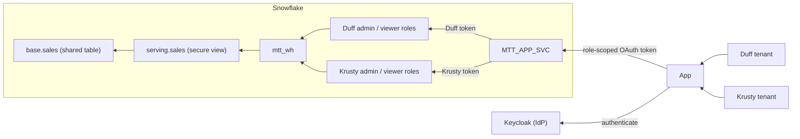

# Variation: Single Service User

## Situation

The basic MTT example creates one Snowflake service user per tenant. This
variation uses one application service user, `MTT_APP_SVC`, while retaining the
four tenant roles. MTT describes shared data tables; it does not require either
shared or dedicated user identities.

Every OAuth token resolves to the same Snowflake user. Its tenant-specific `scp`
claim selects the role. The entitlements filter and amount masking still
evaluate `CURRENT_ROLE()`, so sharing a user does not require sharing a role.



The tradeoff is simpler identity management versus tenant-specific control. A
single service user means fewer Snowflake identities to provision and maintain,
but tenant roles and entitlements still need to be managed. One user per tenant
limits each principal's grants to that tenant, provides a distinct Snowflake
audit identity, and allows its login to be disabled independently.

With a shared service user, tenant revocation must target roles and IdP access
instead; disabling the user interrupts every tenant, and `CURRENT_USER()` no
longer identifies the tenant. Role-scoped OAuth and the entitlements filter
still isolate requests, but compromise of unrestricted access to the shared
principal can expose all tenants rather than only one. Neither model protects
against a compromised IdP capable of issuing tokens for every tenant. Keep the
application user separate from the `mtt_admin` provisioning identity.

## How to achieve this

These are illustrative changes to the [baseline
walkthrough](./00_WALKTHROUGH.md), not an additional runnable migration. Paths
below are relative to `mtt/`. Apply them before a fresh demo setup. Existing
Keycloak users and mappers require explicit updates: the seed scripts'
create-or-reuse behavior does not replace existing attributes or mapper
configurations.

### 1. Provision the application user

In `data/migrations/004_tenants.sql`, replace the two service-user definitions
and their role-to-user grants with:

```sql
CREATE USER IF NOT EXISTS mtt_app_svc
  TYPE = SERVICE
  LOGIN_NAME = 'MTT_APP_SVC'
  DEFAULT_ROLE = PUBLIC
  DEFAULT_SECONDARY_ROLES = ()
  DEFAULT_WAREHOUSE = mtt_wh
  DEFAULT_NAMESPACE = 'MTT_DB.SERVING';

GRANT ROLE tenant_duff_admin TO USER mtt_app_svc;
GRANT ROLE tenant_duff_viewer TO USER mtt_app_svc;
GRANT ROLE tenant_krusty_admin TO USER mtt_app_svc;
GRANT ROLE tenant_krusty_viewer TO USER mtt_app_svc;
```

Keep the four role definitions and their serving-view and warehouse grants. Do
not grant `mtt_admin`, access to `base`, or tenant privileges to `PUBLIC`. The
default role carries no application access; requests must supply an authorized
tenant role. Keep secondary roles inactive.

### 2. Map both login paths to the same user

Change the Snowflake user in `auth/scripts/bootstrap.sh`. Keep the machine
clients separate so each client still receives only its assigned role scope:

```diff
 CLIENTS=(
-  "duff:admin:TENANT_DUFF_SVC:TENANT_DUFF_ADMIN"
-  "duff:viewer:TENANT_DUFF_SVC:TENANT_DUFF_VIEWER"
-  "krusty:admin:TENANT_KRUSTY_SVC:TENANT_KRUSTY_ADMIN"
-  "krusty:viewer:TENANT_KRUSTY_SVC:TENANT_KRUSTY_VIEWER"
+  "duff:admin:MTT_APP_SVC:TENANT_DUFF_ADMIN"
+  "duff:viewer:MTT_APP_SVC:TENANT_DUFF_VIEWER"
+  "krusty:admin:MTT_APP_SVC:TENANT_KRUSTY_ADMIN"
+  "krusty:viewer:MTT_APP_SVC:TENANT_KRUSTY_VIEWER"
 )
```

Make the corresponding change for human logins in `auth/scripts/users.sh`:

```diff
 USERS=(
-  "barney:duff123:TENANT_DUFF_SVC:TENANT_DUFF_ADMIN:Barney (Duff Beer, admin)"
-  "moe:duff123:TENANT_DUFF_SVC:TENANT_DUFF_VIEWER:Moe (Duff Beer, viewer)"
-  "marge:krusty123:TENANT_KRUSTY_SVC:TENANT_KRUSTY_ADMIN:Marge (Krusty Burger, admin)"
-  "homer:krusty123:TENANT_KRUSTY_SVC:TENANT_KRUSTY_VIEWER:Homer (Krusty Burger, viewer)"
+  "barney:duff123:MTT_APP_SVC:TENANT_DUFF_ADMIN:Barney (Duff Beer, admin)"
+  "moe:duff123:MTT_APP_SVC:TENANT_DUFF_VIEWER:Moe (Duff Beer, viewer)"
+  "marge:krusty123:MTT_APP_SVC:TENANT_KRUSTY_ADMIN:Marge (Krusty Burger, admin)"
+  "homer:krusty123:MTT_APP_SVC:TENANT_KRUSTY_VIEWER:Homer (Krusty Burger, viewer)"
 )
```

Only the Snowflake principal is consolidated. Keycloak human identities, the web
client, and the four machine clients remain distinct. The passwords above are
the baseline's local demo fixtures, not production credentials.

### 3. Restrict each OAuth session to its issued role

In `data/migrations/005_oauth.sql`, make the role restriction explicit:

```diff
   EXTERNAL_OAUTH_SNOWFLAKE_USER_MAPPING_ATTRIBUTE = 'LOGIN_NAME'
+  EXTERNAL_OAUTH_ANY_ROLE_MODE = DISABLE
   EXTERNAL_OAUTH_SCOPE_MAPPING_ATTRIBUTE = 'scp';
```

Issue exactly one `session:role:TENANT_<NAME>_<KIND>` scope per token. Do not
issue `session:role-any`, enable secondary roles, or provide an alternate
unrestricted authentication path for the application user. The IdP must control
`snowflake_user` and `scp`; end users must not be able to edit either attribute
or request another tenant's scope. Review Keycloak user-profile permissions
rather than treating the demo's unmanaged attributes as a production
authorization configuration.

Snowflake validates the signed token and enforces its role restriction.
`decodeClaims` in `api/src/db.ts` only decodes the routing claim; decoding is
not signature verification. Do not accept tenant or role overrides from the
browser. See [External OAuth role
restrictions](https://docs.snowflake.com/en/user-guide/oauth-ext-custom#using-any-role-with-external-oauth).

### 4. Preserve role-based data access

No changes are required to `api/src/db.ts` or the role-to-tenant entitlements in
`data/migrations/003_data.sql`. The API already submits the token's role and the
shared database and warehouse. Keep tenant filtering and masking based on the
querying role, not the now-shared `CURRENT_USER()`.

The SQL API request remains token-scoped. If connection pooling is introduced
later, do not reuse authenticated sessions across tenant or role boundaries. If
combining this with the noisy-neighbor variant, retain explicit role-based
warehouse routing; a shared user's default warehouse cannot vary by tenant.

### Verify

Sign out and obtain fresh tokens for each human login. Check the UI's
`snowflake_user`, resolved user, role, and revenue results:

| Login | Resolved user | Role | Visible tenant | Amount |
| --- | --- | --- | --- | --- |
| Barney | `MTT_APP_SVC` | `TENANT_DUFF_ADMIN` | Duff | Visible |
| Moe | `MTT_APP_SVC` | `TENANT_DUFF_VIEWER` | Duff | Masked |
| Marge | `MTT_APP_SVC` | `TENANT_KRUSTY_ADMIN` | Krusty | Visible |
| Homer | `MTT_APP_SVC` | `TENANT_KRUSTY_VIEWER` | Krusty | Masked |

Verify the same identity and role mapping for all four machine clients. In an
authorized local integration test, confirm each role returns only its tenant's
rows through `serving.sales` and cannot read `base.sales` directly. Confirm a
token cannot select a different tenant's role or elevate from viewer to admin,
and that secondary roles remain inactive. These checks exercise authorization,
not just the database name or the UI label.

Queries now share `CURRENT_USER()`. Use the active role for tenant-level
attribution and trusted application audit records for individual human
attribution; a query tag is metadata, not an authorization control.

### Clean up

For a fresh setup using this variation, replace the user cleanup in
`data/teardown/teardown.sql`:

```diff
-DROP USER IF EXISTS tenant_duff_svc;
-DROP USER IF EXISTS tenant_krusty_svc;
+DROP USER IF EXISTS mtt_app_svc;
```

For an existing installation, migrate both token-issuance paths and validate
fresh sessions before retiring the old users. Account for existing sessions and
outstanding tokens during cutover; changing a mapper does not invalidate
previously issued tokens. Retain cleanup for old users until they are retired.
Do not drop or recreate data tables to change the authentication identity.
