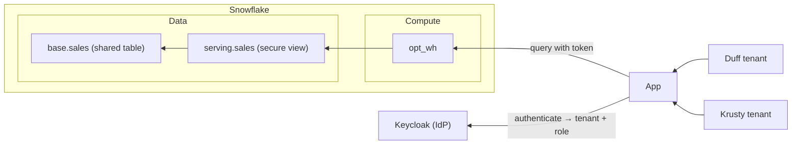

# Walkthrough 

## Situation

A **multitenant-table (MTT) architecture** for managed apps on top of Snowflake
allows for the quickest path to a multitenant experience with data served from
Snowflake. In this scenario, an application - along with an identity provider -
sit outside of Snowflake; multiple tenants are provisioned in the identity
provider and - using a service account per tenant - grant access to the
appropriate underlying data, which is all stored in **shared objects**:



## Objectives

In following the `justfile` recipes, you'll:

1. **Bootstrap** a basic multitenant-table data model. 
2. **Run** a local identity provider.
3. **Provision** an OAuth connection in Snowflake.
4. **Add** two users to each tenant with two levels of access.
5. **Log in** to the application as different users, seeing only the data their
   tenant/role allows them to see.

All of this - aside from what's inside of Snowflake - will run on your local
machine.

## Execution

### 1. Prerequisites

With the tools from the repo's [What you'll
need](../../README.md#what-youll-need) installed, configure your environment.

#### 1.1 Copy the `.env.example`

To begin, copy the `.env.example` in the `opt/` directory:

```sh
cd opt && cp .env.example .env
```

#### 1.2 Configure ngrok

The repo uses ngrok to tunnel your locally-running **IdP service** to Snowflake.
[Provision a static
domain](https://ngrok.com/blog/free-static-domains-ngrok-users#find-your-dev-domain)
and grab your auth token from the ngrok dashboard, then set both in the `.env`:

```plaintext
NGROK_AUTHTOKEN=2abc...
KEYCLOAK_PUBLIC_URL=https://<your_domain>.ngrok.app
```

Your domain serves the public URL of your IdP later, hence the key name in the
`.env`.

#### 1.3 Add your Snowflake identifier

Also set `SNOWFLAKE_HOST` in the `.env` (e.g.
`abcd-xy12345.snowflakecomputing.com`); the app containers use it to reach the
Snowflake SQL API.

### 2. Bootstrap

With the `.env` in place, point the `setup` recipe at your Snow CLI connection -
the same name you'd pass to `snow sql -c`, which you can list with `snow
connection list`:

```sh
just setup <connection>
```

That runs four migrations in order:

- **`001_init.sql`** — creates the `opt_admin` role and grants it to
`CURRENT_USER()`. This role owns the data model.
- **`002_objects.sql`** — creates the `opt_db` database, the shared `opt_wh`
warehouse, and two schemas: `base` (raw tables and entitlements) and `serving`
(the secure views we expose). All tenants share these objects.
- **`003_data.sql`** — creates one `base.sales` table for all tenants, clustered
by `(tenant_id, sale_ts)` so tenant-scoped queries prune other tenants'
micro-partitions. Seeds a million rows across the two tenants, then adds:
  - `base.entitlements`, mapping each **role** to a **tenant_id**.
  - `base.mask_amount`, a masking policy returning `amount` only when
  `CURRENT_ROLE()` ends in `_ADMIN`, else `NULL`.

  The `serving.sales` secure view joins the two on `WHERE e.role_name =
  CURRENT_ROLE()`. Both row isolation and column masking key off the querying
  role.
- **`004_tenants.sql`** — creates four roles (`admin`/`viewer` per tenant) and
one `TYPE = SERVICE` user per tenant (`TENANT_DUFF_SVC`, `TENANT_KRUSTY_SVC`),
grants each tenant's two roles to its service user, and grants all four roles
identical access to the serving schema, view, and warehouse — never `base`.

The split: one service account per tenant, one role per access level. The OAuth
token selects the active role per request.

### 3. Run the IdP

Start Keycloak and the ngrok tunnel:

```sh
just idp-up
```

This starts both containers and waits ~20 seconds. ngrok publishes Keycloak at
your `KEYCLOAK_PUBLIC_URL`, giving Snowflake a public issuer URL to fetch
signing keys from — it can't reach `localhost`.

Then seed the realm and the machine clients:

```sh
just idp-seed
```

`idp-seed` creates the `tenants` realm and one confidential service-account
client per tenant/class (`tenant-duff-admin`, `tenant-duff-viewer`, etc.).
Protocol mappers stamp three claims onto each token: `aud` = `snowflake`,
`snowflake_user` (the service user), and `scp` = `session:role:<ROLE>` (the role
to activate). Client IDs and secrets land in `auth/clients.json`. Human logins
come in step 5.

### 4. Provision OAuth in Snowflake

Now teach Snowflake to trust tokens minted by that realm:

```sh
just oauth-add <connection>
```

The recipe substitutes your `KEYCLOAK_PUBLIC_URL` into `005_oauth.sql` and runs
it, creating the `EXTERNAL_OAUTH` security integration `opt_keycloak`. Two
mappings matter:

- `EXTERNAL_OAUTH_TOKEN_USER_MAPPING_CLAIM = 'snowflake_user'` → `LOGIN_NAME`:
the `snowflake_user` claim resolves the token to a Snowflake login (e.g.
`TENANT_DUFF_SVC`).
- `EXTERNAL_OAUTH_SCOPE_MAPPING_ATTRIBUTE = 'scp'`: the `scp` claim selects the
active role, so one service user runs as admin or viewer per request.

The integration points at the tunnel's JWS keys URL, so Snowflake auto-refreshes
Keycloak's signing keys through rotation.

### 5. Seed users

```sh
just idp-add-users
```

This creates the `opt-web` confidential client — the web app's
authorization-code (PKCE) login — writing its secret to `auth/web.env`, then
creates four users, two per tenant:

| Username | Password    | Tenant        | Role activated        |
|----------|-------------|---------------|-----------------------|
| `barney` | `duff123`   | Duff Beer     | `TENANT_DUFF_ADMIN`   |
| `moe`    | `duff123`   | Duff Beer     | `TENANT_DUFF_VIEWER`  |
| `marge`  | `krusty123` | Krusty Burger | `TENANT_KRUSTY_ADMIN` |
| `homer`  | `krusty123` | Krusty Burger | `TENANT_KRUSTY_VIEWER`|

Each user carries `snowflake_user` and `scp` as attributes, so their tokens
assert the same claims as the service-account clients. Barney and Moe both
resolve to `TENANT_DUFF_SVC`; Barney activates the admin role, Moe the viewer
role.

### 6. Log in

Build and start the API (a small BFF) and the web app:

```sh
just app-up
```

Open **http://localhost:8000**, click **Sign in**, and log in as any of the four
users. The app shows:

1. **Token asserts** — the `snowflake_user`, `scp`, and `aud` claims from the
   access token.
2. **Snowflake resolved** — `CURRENT_USER()` and `CURRENT_ROLE()`.
3. **Revenue by region** — a `GROUP BY region` over `serving.sales`.

Compare across users:

- **Barney** (Duff admin): Duff rows, with revenue.
- **Moe** (Duff viewer): same Duff rows, revenue reads **"— restricted —"**
(masked to `NULL`).
- **Marge** / **Homer**: Krusty rows only, admin/viewer splitting revenue the
same way.

One table, one secure view, per-role rows and columns. Sign out (which also ends
the Keycloak SSO session) before switching users.

### 7. Clean up

#### Temporary

Stop the local stack, keeping the Keycloak volume and Snowflake objects:

```sh
docker compose down
```

Resume later with `just idp-up` and `just app-up`.

#### Permanent

Tear down local volumes and the Snowflake data model:

```sh
just teardown <connection>
```

This runs `docker compose down -v` and `teardown.sql`, dropping the database,
warehouse, four tenant roles, two service users, `opt_admin`, and the
`opt_keycloak` integration. The generated `auth/clients.json` and `auth/web.env`
remain on disk; remove them for a clean slate:

```sh
rm -f auth/clients.json auth/web.env
```

## Next steps

This is the most basic example in the repository. Later, we'll see other
patterns on the spectrum, but there are also variants of each. For more
information, see:

- [`opt/` noisy neighbor](./01_variation_noisy_neighbor.md)
