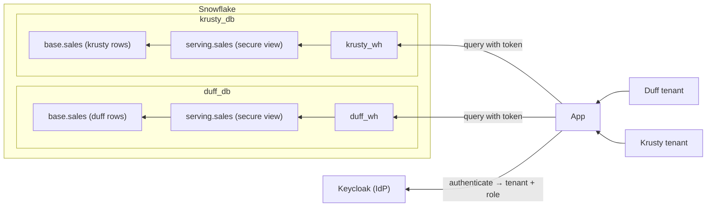

# Walkthrough 

## Situation

An **object-per-tenant (OTT) architecture** for managed apps on top of Snowflake
trades density for isolation: instead of one shared data model, every tenant
gets its own database, warehouse, and objects. An application - along with an
identity provider - sits outside of Snowflake; multiple tenants are provisioned
in the identity provider and - using a service account per tenant - reach only
their own tenant's database. Isolation is structural: the database boundary
keeps tenants apart, so there's no shared table and no entitlements join to get
wrong. The only in-Snowflake policy left is a masking policy that hides `amount`
from viewers:



## Objectives

In following the `justfile` recipes, you'll:

1. **Bootstrap** a control plane and provision two isolated tenants.
2. **Run** a local identity provider.
3. **Provision** an OAuth connection in Snowflake.
4. **Add** two users to each tenant with two levels of access.
5. **Log in** to the application as different users, seeing only the data their
   tenant/role allows them to see.

All of this - aside from what's inside of Snowflake - will run on your local
machine.

## Execution

### 1. Prerequisites

With the tools from the repo's [What you'll
need](../../README.md#what-youll-need) installed, configure your environment.

#### 1.1 Copy the `.env.example`

To begin, copy the `.env.example` in the `opt/` directory:

```sh
cd opt && cp .env.example .env
```

#### 1.2 Configure ngrok

The repo uses ngrok to tunnel your locally-running **IdP service** to Snowflake.
[Provision a static
domain](https://ngrok.com/blog/free-static-domains-ngrok-users#find-your-dev-domain)
and grab your auth token from the ngrok dashboard, then set both in the `.env`:

```plaintext
NGROK_AUTHTOKEN=2abc...
KEYCLOAK_PUBLIC_URL=https://<your_domain>.ngrok.app
```

Your domain serves the public URL of your IdP later, hence the key name in the
`.env`.

#### 1.3 Add your Snowflake identifier

Also set `SNOWFLAKE_HOST` in the `.env` (e.g.
`abcd-xy12345.snowflakecomputing.com`); the app containers use it to reach the
Snowflake SQL API.

### 2. Bootstrap

With the `.env` in place, point the `setup` recipe at your Snow CLI connection -
the same name you'd pass to `snow sql -c`, which you can list with `snow
connection list`:

```sh
just setup <connection>
```

That runs three migrations in order:

- **`001_init.sql`** — creates the `opt_admin` control-plane role (granted to
`SYSADMIN` and to `CURRENT_USER()`), the `opt_admin_db` database with its
`admin` schema, and the `opt_admin_wh` warehouse. This is the control plane that
provisions tenants — no tenant data lives here.
- **`002_tenants_sprocs.sql`** — creates seven stored procedures in
`opt_admin_db.admin`, each one step of standing up a tenant:
`create_tenant_db`, `create_tenant_schemas`, `create_tenant_wh`,
`create_tenant_roles`, `create_tenant_svc_principal`, `create_tenant_data`, and
`grant_tenant_usage`. Because every tenant is provisioned the same way, the
repetition lives in procedures instead of copy-pasted DDL.
  - `create_tenant_data` seeds a `<tenant>_db.base.sales` table (200k rows,
  clustered by `sale_ts`), adds `base.mask_amount` — a masking policy returning
  `amount` only when `CURRENT_ROLE()` ends in `_ADMIN`, else `NULL` — and
  exposes `serving.sales`, a secure view over the base table.
  - `grant_tenant_usage` grants both tenant roles to the tenant's service user,
  then gives each role identical access to the tenant's serving schema, view,
  and warehouse — never `base`.
- **`003_add_tenants.sql`** — calls the seven procedures for `duff` and
`krusty`, materializing each tenant's `<tenant>_db`, `<tenant>_wh`, roles, and
`TYPE = SERVICE` user (`TENANT_DUFF_SVC`, `TENANT_KRUSTY_SVC`). In production
you'd drive this from a provisioning script, not a migration; the two defaults
are hardcoded here for simplicity.

The split: one database and warehouse per tenant, one service account per
tenant, one role per access level. The database boundary handles row isolation;
the masking policy handles column access; the OAuth token selects the active
role per request. OAuth itself (`005_oauth.sql`) is applied separately in step
4.

### 3. Run the IdP

Start Keycloak and the ngrok tunnel:

```sh
just idp-up
```

This starts both containers and waits ~20 seconds. ngrok publishes Keycloak at
your `KEYCLOAK_PUBLIC_URL`, giving Snowflake a public issuer URL to fetch
signing keys from — it can't reach `localhost`.

Then seed the realm and the machine clients:

```sh
just idp-seed
```

`idp-seed` creates the `tenants` realm and one confidential service-account
client per tenant/class (`tenant-duff-admin`, `tenant-duff-viewer`, etc.).
Protocol mappers stamp three claims onto each token: `aud` = `snowflake`,
`snowflake_user` (the service user), and `scp` = `session:role:<ROLE>` (the role
to activate). Client IDs and secrets land in `auth/clients.json`. Human logins
come in step 5.

### 4. Provision OAuth in Snowflake

Now teach Snowflake to trust tokens minted by that realm:

```sh
just oauth-add <connection>
```

The recipe substitutes your `KEYCLOAK_PUBLIC_URL` into `005_oauth.sql` and runs
it, creating the `EXTERNAL_OAUTH` security integration `opt_keycloak`. Two
mappings matter:

- `EXTERNAL_OAUTH_TOKEN_USER_MAPPING_CLAIM = 'snowflake_user'` → `LOGIN_NAME`:
the `snowflake_user` claim resolves the token to a Snowflake login (e.g.
`TENANT_DUFF_SVC`).
- `EXTERNAL_OAUTH_SCOPE_MAPPING_ATTRIBUTE = 'scp'`: the `scp` claim selects the
active role, so one service user runs as admin or viewer per request.

The integration points at the tunnel's JWS keys URL, so Snowflake auto-refreshes
Keycloak's signing keys through rotation.

### 5. Seed users

```sh
just idp-add-users
```

This creates the `opt-web` confidential client — the web app's
authorization-code (PKCE) login — writing its secret to `auth/web.env`, then
creates four users, two per tenant:

| Username | Password    | Tenant        | Role activated        |
|----------|-------------|---------------|-----------------------|
| `barney` | `duff123`   | Duff Beer     | `TENANT_DUFF_ADMIN`   |
| `moe`    | `duff123`   | Duff Beer     | `TENANT_DUFF_VIEWER`  |
| `marge`  | `krusty123` | Krusty Burger | `TENANT_KRUSTY_ADMIN` |
| `homer`  | `krusty123` | Krusty Burger | `TENANT_KRUSTY_VIEWER`|

Each user carries `snowflake_user` and `scp` as attributes, so their tokens
assert the same claims as the service-account clients. Barney and Moe both
resolve to `TENANT_DUFF_SVC`; Barney activates the admin role, Moe the viewer
role.

### 6. Log in

Build and start the API (a small BFF) and the web app:

```sh
just app-up
```

Open **http://localhost:8000**, click **Sign in**, and log in as any of the four
users. The app shows:

1. **Token asserts** — the `snowflake_user`, `scp`, and `aud` claims from the
   access token.
2. **Snowflake resolved** — `CURRENT_USER()`, `CURRENT_ROLE()`, and
   `CURRENT_WAREHOUSE()`.
3. **Revenue by region** — a `GROUP BY region` over `serving.sales`.

Compare across users:

- **Barney** (Duff admin): Duff rows, with revenue, on `DUFF_WH`.
- **Moe** (Duff viewer): same Duff rows on `DUFF_WH`, revenue reads **"—
restricted —"** (masked to `NULL`).
- **Marge** / **Homer**: Krusty rows only, on `KRUSTY_WH`, admin/viewer
splitting revenue the same way.

Each tenant's own database, warehouse, and secure view — separate compute and
separate storage, with only the masking policy shared in spirit across tenants.
Sign out (which also ends the Keycloak SSO session) before switching users.

### 7. Clean up

#### Temporary

Stop the local stack, keeping the Keycloak volume and Snowflake objects:

```sh
docker compose down
```

Resume later with `just idp-up` and `just app-up`.

#### Permanent

Tear down local volumes and the Snowflake data model:

```sh
just teardown <connection>
```

This runs `docker compose down -v` and `teardown.sql`, dropping both tenant
databases (`duff_db`, `krusty_db`) and warehouses (`duff_wh`, `krusty_wh`), the
four tenant roles, the two service users, the control plane (`opt_admin_db`,
`opt_admin_wh`, `opt_admin`), and the `opt_keycloak` integration. The generated
`auth/clients.json` and `auth/web.env` remain on disk; remove them for a clean
slate:

```sh
rm -f auth/clients.json auth/web.env
```

## Next steps

Object-per-tenant sits in the middle of the isolation spectrum — more isolated
than the shared-table model, less operationally heavy than an account per
tenant. To see the other patterns, follow:

- [`mtt/` walkthrough](../../mtt/docs/00_WALKTHROUGH.md) — the most-shared end:
one data model, shared compute, isolation enforced with secure views and
entitlements.
- Account per tenant (ATT) — the most-isolated end; coming soon. See the
[repository README](../../README.md#architectures) for the full spectrum.
