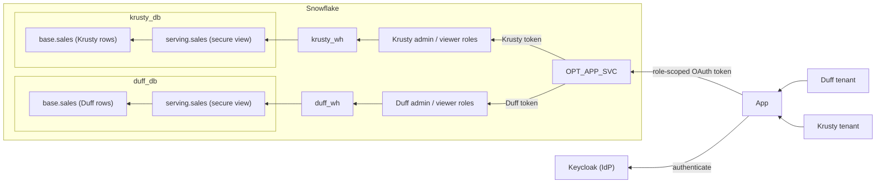

# Variation: Single Service User

## Situation

The basic OPT example creates one Snowflake service user per tenant. This
variation uses one application service user, `OPT_APP_SVC`, while retaining each
tenant's database, warehouse, and admin/viewer roles. Object per tenant
describes data separation; it does not require a dedicated user identity.

Every OAuth token resolves to the same Snowflake user. Its tenant-specific `scp`
claim selects the role. That role's grants authorize access to the tenant's
objects; the API routes the query to its database and warehouse. Choosing a
database is routing, not authorization.



The tradeoff is simpler identity management versus tenant-specific control. A
single service user means fewer Snowflake identities to provision and maintain,
but tenant databases, warehouses, and roles still need to be managed. One user
per tenant limits each principal's grants to that tenant's objects, provides a
distinct Snowflake audit identity, and allows its login to be disabled
independently. 

With a shared service user, tenant revocation must target roles and IdP access
instead; disabling the user interrupts every tenant, and `CURRENT_USER()` no
longer identifies the tenant. Role-scoped OAuth and object grants still isolate
requests, but separate databases do not contain the impact of compromised
unrestricted access to a principal holding roles for all of them. Neither model
protects against a compromised IdP capable of issuing tokens for every tenant.
Keep the application user separate from the `opt_admin` provisioning identity.

## How to achieve this

These are illustrative changes to the [baseline
walkthrough](./00_WALKTHROUGH.md), not an additional runnable migration. Paths
below are relative to `opt/`. Apply them before a fresh demo setup. Existing
Keycloak users and mappers require explicit updates: the seed scripts'
create-or-reuse behavior does not replace existing attributes or mapper
configurations.

### 1. Provision the application user once

In `data/migrations/003_add_tenants.sql`, create the application user after the
role/warehouse selection and before the tenant procedure calls:

```sql
CREATE USER IF NOT EXISTS opt_app_svc
  TYPE = SERVICE
  LOGIN_NAME = 'OPT_APP_SVC'
  DEFAULT_ROLE = PUBLIC
  DEFAULT_SECONDARY_ROLES = ();
```

Do not assign a tenant-specific default database or warehouse. The API already
supplies both per request. Do not grant `opt_admin`, direct access to `base`, or
tenant privileges to `PUBLIC`. The default role carries no application access;
requests must supply an authorized tenant role. Keep secondary roles inactive.

Remove the `create_tenant_svc_principal` procedure definition from
`data/migrations/002_tenants_sprocs.sql`. Remove its calls from
`data/migrations/003_add_tenants.sql`:

```diff
 CALL opt_admin_db.admin.create_tenant_roles('duff');
-CALL opt_admin_db.admin.create_tenant_svc_principal('duff');
 CALL opt_admin_db.admin.create_tenant_data('duff');
 CALL opt_admin_db.admin.grant_tenant_usage('duff');
```

```diff
 CALL opt_admin_db.admin.create_tenant_roles('krusty');
-CALL opt_admin_db.admin.create_tenant_svc_principal('krusty');
 CALL opt_admin_db.admin.create_tenant_data('krusty');
 CALL opt_admin_db.admin.grant_tenant_usage('krusty');
```

Keep the other six tenant provisioning procedures and their calls. New tenants
still get separate objects and roles, but no new Snowflake user.

### 2. Grant tenant roles to the application user

In `grant_tenant_usage` in `data/migrations/002_tenants_sprocs.sql`, replace
only the role-to-user grant block:

```diff
-  -- Both roles belong to the tenant's single service user.
-  EXECUTE IMMEDIATE 'GRANT ROLE tenant_' || tenant_name || '_admin, tenant_' || tenant_name || '_viewer TO USER tenant_' || tenant_name || '_svc';
+  LET admin_role STRING := 'TENANT_' || UPPER(tenant_name) || '_ADMIN';
+  LET viewer_role STRING := 'TENANT_' || UPPER(tenant_name) || '_VIEWER';
+  GRANT ROLE IDENTIFIER(:admin_role) TO USER opt_app_svc;
+  GRANT ROLE IDENTIFIER(:viewer_role) TO USER opt_app_svc;
```

Keep the subsequent database, serving-schema, view, and warehouse grants to each
tenant role unchanged. Do not grant tenant roles to one another or create an
aggregate application role that inherits every tenant's privileges.

### 3. Map both login paths to the same user

Change the Snowflake user in `auth/scripts/bootstrap.sh`. Keep the machine
clients separate so each client still receives only its assigned role scope:

```diff
 CLIENTS=(
-  "duff:admin:TENANT_DUFF_SVC:TENANT_DUFF_ADMIN"
-  "duff:viewer:TENANT_DUFF_SVC:TENANT_DUFF_VIEWER"
-  "krusty:admin:TENANT_KRUSTY_SVC:TENANT_KRUSTY_ADMIN"
-  "krusty:viewer:TENANT_KRUSTY_SVC:TENANT_KRUSTY_VIEWER"
+  "duff:admin:OPT_APP_SVC:TENANT_DUFF_ADMIN"
+  "duff:viewer:OPT_APP_SVC:TENANT_DUFF_VIEWER"
+  "krusty:admin:OPT_APP_SVC:TENANT_KRUSTY_ADMIN"
+  "krusty:viewer:OPT_APP_SVC:TENANT_KRUSTY_VIEWER"
 )
```

Make the corresponding change for human logins in `auth/scripts/users.sh`:

```diff
 USERS=(
-  "barney:duff123:TENANT_DUFF_SVC:TENANT_DUFF_ADMIN:Barney (Duff Beer, admin)"
-  "moe:duff123:TENANT_DUFF_SVC:TENANT_DUFF_VIEWER:Moe (Duff Beer, viewer)"
-  "marge:krusty123:TENANT_KRUSTY_SVC:TENANT_KRUSTY_ADMIN:Marge (Krusty Burger, admin)"
-  "homer:krusty123:TENANT_KRUSTY_SVC:TENANT_KRUSTY_VIEWER:Homer (Krusty Burger, viewer)"
+  "barney:duff123:OPT_APP_SVC:TENANT_DUFF_ADMIN:Barney (Duff Beer, admin)"
+  "moe:duff123:OPT_APP_SVC:TENANT_DUFF_VIEWER:Moe (Duff Beer, viewer)"
+  "marge:krusty123:OPT_APP_SVC:TENANT_KRUSTY_ADMIN:Marge (Krusty Burger, admin)"
+  "homer:krusty123:OPT_APP_SVC:TENANT_KRUSTY_VIEWER:Homer (Krusty Burger, viewer)"
 )
```

Only the Snowflake principal is consolidated. Keycloak human identities, the web
client, and the four machine clients remain distinct. The passwords above are
the baseline's local demo fixtures, not production credentials.

### 4. Restrict each OAuth session to its issued role

In `data/migrations/005_oauth.sql`, make the role restriction explicit:

```diff
   EXTERNAL_OAUTH_SNOWFLAKE_USER_MAPPING_ATTRIBUTE = 'LOGIN_NAME'
+  EXTERNAL_OAUTH_ANY_ROLE_MODE = DISABLE
   EXTERNAL_OAUTH_SCOPE_MAPPING_ATTRIBUTE = 'scp';
```

Issue exactly one `session:role:TENANT_<NAME>_<KIND>` scope per token. Do not
issue `session:role-any`, enable secondary roles, or provide an alternate
unrestricted authentication path for the application user. The IdP must control
`snowflake_user` and `scp`; end users must not be able to edit either attribute
or request another tenant's scope. Review Keycloak user-profile permissions
rather than treating the demo's unmanaged attributes as a production
authorization configuration.

Snowflake validates the signed token and enforces its role restriction.
`decodeClaims` in `api/src/db.ts` only decodes the routing claim; decoding is
not signature verification. Do not accept tenant or role overrides from the
browser. See [External OAuth role
restrictions](https://docs.snowflake.com/en/user-guide/oauth-ext-custom#using-any-role-with-external-oauth).

### 5. Preserve role-based routing

No API change is required. `getTenantName` in `api/src/db.ts` derives the tenant
from the role, and `query` supplies `<TENANT>_DB`, `<TENANT>_WH`, and `SERVING`
with each SQL API request. It does not derive routing from the user name. Keep
this behavior and the existing per-database masking policies.

The SQL API request remains token-scoped. If connection pooling is introduced
later, do not reuse authenticated sessions across tenant or role boundaries.
Database and warehouse defaults on a shared user cannot replace this routing.

### Verify

Sign out and obtain fresh tokens for each human login. All four must resolve to
`OPT_APP_SVC`, while the existing roles, warehouses, and results remain:

| Login | Role | Database | Warehouse | Amount |
| --- | --- | --- | --- | --- |
| Barney | `TENANT_DUFF_ADMIN` | `DUFF_DB` | `DUFF_WH` | Visible |
| Moe | `TENANT_DUFF_VIEWER` | `DUFF_DB` | `DUFF_WH` | Masked |
| Marge | `TENANT_KRUSTY_ADMIN` | `KRUSTY_DB` | `KRUSTY_WH` | Visible |
| Homer | `TENANT_KRUSTY_VIEWER` | `KRUSTY_DB` | `KRUSTY_WH` | Masked |

The UI already shows resolved user, role, and warehouse. Verify the database
through `CURRENT_DATABASE()` in an authorized local integration test; no UI
change is required. Verify the same mapping for all four machine clients.
Confirm each role can read only its tenant's serving view, cannot read the other
tenant's view even using its fully qualified name, and cannot read `base.sales`
directly. Confirm a token cannot select another tenant's role or elevate from
viewer to admin, and that secondary roles remain inactive.

Queries now share `CURRENT_USER()`. Use the active role for tenant-level
attribution and trusted application audit records for individual human
attribution; a query tag is metadata, not an authorization control.

### Clean up

For a fresh setup using this variation, replace the user cleanup in
`data/teardown/teardown.sql`:

```diff
-DROP USER IF EXISTS tenant_duff_svc;
-DROP USER IF EXISTS tenant_krusty_svc;
+DROP USER IF EXISTS opt_app_svc;
```

Retain the tenant database, warehouse, and role cleanup. Retiring one tenant
must revoke that tenant's roles from the shared user and remove its IdP access;
it must not drop the application user used by the remaining tenants.

For an existing installation, provision the shared user, update the grant
procedure and both token-issuance paths, and validate fresh sessions before
retiring the old users. Remove the obsolete service-user procedure and its
provisioning callers after cutover. Account for existing sessions and
outstanding tokens; changing a mapper does not invalidate previously issued
tokens. Retain cleanup for old users until they are retired. Do not rerun the
data-seeding procedure or recreate tenant databases to change identity.
